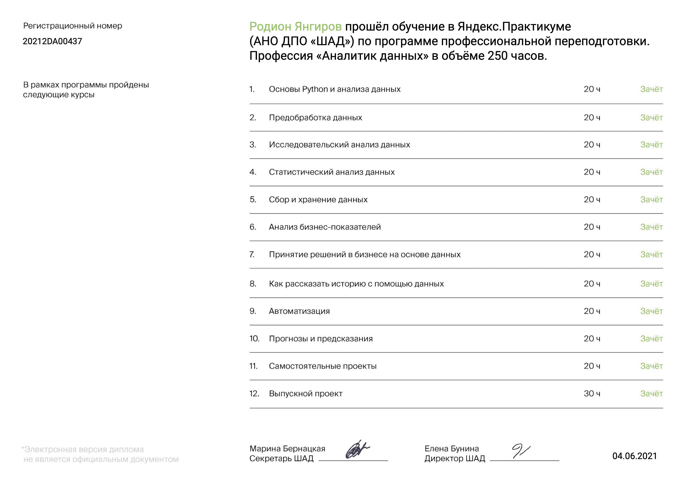

Репозиторий создан для публикации проектов, выполненных в процессе обучения по программе "Аналитик данных". 

| Спринт | Проект | Краткое описание | Ключевые слова |
| --- | --- | --- | --- |
| 1 | [Введение в профессию "Аналитик данных"](https://github.com/kruspe2009/yandex_praktikum_da/blob/main/01.%20%D0%92%D0%B2%D0%B5%D0%B4%D0%B5%D0%BD%D0%B8%D0%B5%20%D0%B2%20%D0%BF%D1%80%D0%BE%D1%84%D0%B5%D1%81%D1%81%D0%B8%D1%8E%20%22%D0%90%D0%BD%D0%B0%D0%BB%D0%B8%D1%82%D0%B8%D0%BA%20%D0%B4%D0%B0%D0%BD%D0%BD%D1%8B%D1%85%22/da_intro_project.ipynb) | Вводный проект, входящий в бесплатную часть курса "Аналитик данных" от Практикуму. В процессе необходимо выполнить несколько простых задач с данными сервиса Я.Музыка. | `pandas`|
| 2 | [Предобработка данных](https://github.com/kruspe2009/yandex_praktikum_da/blob/main/02.%20%D0%9F%D1%80%D0%B5%D0%B4%D0%BE%D0%B1%D1%80%D0%B0%D0%B1%D0%BE%D1%82%D0%BA%D0%B0%20%D0%B4%D0%B0%D0%BD%D0%BD%D1%8B%D1%85/data_preprocessing.ipynb) | Заказчик — кредитный отдел банка. Нужно разобраться, влияет ли семейное положение и количество детей клиента на факт погашения кредита в срок. Входные данные от банка — статистика о платёжеспособности клиентов. | `pandas`|
| 3 | [Исследовательский анализ данных](https://github.com/kruspe2009/yandex_praktikum_da/blob/main/03.%20%D0%98%D1%81%D1%81%D0%BB%D0%B5%D0%B4%D0%BE%D0%B2%D0%B0%D1%82%D0%B5%D0%BB%D1%8C%D1%81%D0%BA%D0%B8%D0%B9%20%D0%B0%D0%BD%D0%B0%D0%BB%D0%B8%D0%B7%20%D0%B4%D0%B0%D0%BD%D0%BD%D1%8B%D1%85/eda.ipynb) | В рамках проекта выполнен исследовательский анализ данных объявлений о продаже недвижимости на рынке СПб. Основная задача - определить ключевые параметры, влияющие но стоимость недвижимости, а также позволяющие определить мошенническую активность. | `pandas` `math` `EDA`|
| 4 | [Статистический анализ данных](https://github.com/kruspe2009/yandex_praktikum_da/blob/main/04.%20%D0%A1%D1%82%D0%B0%D1%82%D0%B8%D1%81%D1%82%D0%B8%D1%87%D0%B5%D1%81%D0%BA%D0%B8%D0%B9%20%D0%B0%D0%BD%D0%B0%D0%BB%D0%B8%D0%B7%20%D0%B4%D0%B0%D0%BD%D0%BD%D1%8B%D1%85/stat_analysis.ipynb) | Необходимо проанализировать затраты пользователей различных тарифов оператора сотовой связи и определить, какие из них приносят больше денег. Также в рамках проекта выполнена проверка статистических гипотез. | `pandas` `statistics` `numpy` `scipy` `Student's t-test`|
| 5 | [Сборный проект - 1](https://github.com/kruspe2009/yandex_praktikum_da/blob/main/05.%20%D0%A1%D0%B1%D0%BE%D1%80%D0%BD%D1%8B%D0%B9%20%D0%BF%D1%80%D0%BE%D0%B5%D0%BA%D1%82-1/mixed_project_1.ipynb) | В рамках проекта предполагается анализ данных о продажах компьютерных игр для разных платформ - произведен исследовательский анализ данных, проверены статистические гипотезы и сформулированы выводы. | `pandas`  `matplotlib` `numpy` `scipy` `Student's t-test`|
| 6 | [Сбор и хранение данных](https://github.com/kruspe2009/yandex_praktikum_da/blob/main/06.%20%D0%A1%D0%B1%D0%BE%D1%80%20%D0%B8%20%D1%85%D1%80%D0%B0%D0%BD%D0%B5%D0%BD%D0%B8%D0%B5%20%D0%B4%D0%B0%D0%BD%D0%BD%D1%8B%D1%85/data_collecting.ipynb) | В тетрадке Jupyter Notebook простейший результат обработки запросов к БД с данными об авиаперевозках. Запросы к БД выполнялись в тренажере и [опубликованы в виде отдельного файла](https://github.com/kruspe2009/yandex_praktikum_da/blob/main/06.%20%D0%A1%D0%B1%D0%BE%D1%80%20%D0%B8%20%D1%85%D1%80%D0%B0%D0%BD%D0%B5%D0%BD%D0%B8%D0%B5%20%D0%B4%D0%B0%D0%BD%D0%BD%D1%8B%D1%85/sql_requests.ipynb). | `pandas`  `matplotlib` `SQL`|
| 7 | [Анализ бизнес-показателей](https://github.com/kruspe2009/yandex_praktikum_DA/blob/main/07.%20%D0%90%D0%BD%D0%B0%D0%BB%D0%B8%D0%B7%20%D0%B1%D0%B8%D0%B7%D0%BD%D0%B5%D1%81-%D0%BF%D0%BE%D0%BA%D0%B0%D0%B7%D0%B0%D1%82%D0%B5%D0%BB%D0%B5%D0%B9/business_metrics_analysis.ipynb) | Задача: помочь маркетологам снизить расходы — отказаться от невыгодных источников трафика и перераспределить бюджет. | `pandas` `numpy` `matplotlib` `seaborn` `DAU` `MAU` `WAU` `CAC` `LTV` `Retention Rate` `ROMI`|
| 8 | [Принятие решений в бизнесе на основе данных](https://github.com/kruspe2009/yandex_praktikum_DA/blob/main/08.%20%D0%9F%D1%80%D0%B8%D0%BD%D1%8F%D1%82%D0%B8%D0%B5%20%D1%80%D0%B5%D1%88%D0%B5%D0%BD%D0%B8%D0%B9%20%D0%B2%20%D0%B1%D0%B8%D0%B7%D0%BD%D0%B5%D1%81%D0%B5%20%D0%BD%D0%B0%20%D0%BE%D1%81%D0%BD%D0%BE%D0%B2%D0%B5%20%D0%B4%D0%B0%D0%BD%D0%BD%D1%8B%D1%85/decision_based_on_data.ipynb) | Интернет-магазин рассматривает различные способы наращивания конверсии. В рамках проекта требуется оценить "перспективность" различных гипотез с помощью фреймворков ICE и RICE. Также требуется оценка результатов A/B-теста. | `pandas` `numpy` `matplotlib` `scipy` `ICE` `RICE` `A/B-test`|
| 9 | [Как рассказать историю с помощью данных](https://github.com/kruspe2009/yandex_praktikum_DA/blob/main/09.%20%D0%9A%D0%B0%D0%BA%20%D1%80%D0%B0%D1%81%D1%81%D0%BA%D0%B0%D0%B7%D0%B0%D1%82%D1%8C%20%D0%B8%D1%81%D1%82%D0%BE%D1%80%D0%B8%D1%8E%20%D1%81%20%D0%BF%D0%BE%D0%BC%D0%BE%D1%89%D1%8C%D1%8E%20%D0%B4%D0%B0%D0%BD%D0%BD%D1%8B%D1%85/data_visualization.ipynb) | В рамках проекта необходимо выбрать наиболее удачный формат заведения и район для нового заведения общественного питания. [По итогам также подготовлена презентация.](https://github.com/kruspe2009/yandex_praktikum_DA/blob/main/09.%20%D0%9A%D0%B0%D0%BA%20%D1%80%D0%B0%D1%81%D1%81%D0%BA%D0%B0%D0%B7%D0%B0%D1%82%D1%8C%20%D0%B8%D1%81%D1%82%D0%BE%D1%80%D0%B8%D1%8E%20%D1%81%20%D0%BF%D0%BE%D0%BC%D0%BE%D1%89%D1%8C%D1%8E%20%D0%B4%D0%B0%D0%BD%D0%BD%D1%8B%D1%85/data_visualization_keynote.pdf)  | `pandas` `numpy` `seaborn` `requests`|
| 10 | [Событийная аналитика](https://github.com/kruspe2009/yandex_praktikum/blob/main/10.%20%D0%A1%D0%BE%D0%B1%D1%8B%D1%82%D0%B8%D0%B9%D0%BD%D0%B0%D1%8F%20%D0%B0%D0%BD%D0%B0%D0%BB%D0%B8%D1%82%D0%B8%D0%BA%D0%B0/event_analytics.ipynb) | Компании-стартапу по продаже продуктов питания требуется анализ воронки событий. | `pandas` `plotly` `numpy` `math` `seaborn` `requests` `z-test` `A/B-test`|
| 11 | [Дашборд в Tableau](https://public.tableau.com/app/profile/rodion.yangirov/viz/My_First_Praktikum_Dashboard/Dashboard1) | [По запросу от сотрудников](https://github.com/kruspe2009/yandex_praktikum_DA/blob/main/11.%20%D0%A1%D0%BE%D0%B7%D0%B4%D0%B0%D0%BD%D0%B8%D0%B5%20%D0%B4%D0%B0%D1%88%D0%B1%D0%BE%D1%80%D0%B4%D0%B0/dashboard_request.png) компании необходимо создать дашборд, который позволит этим сотрудников видеть наиболее популярные темы карточек в сервисе Я.Дзен| `Tableau` |
| 12 | [Прогнозы и предсказания](https://github.com/kruspe2009/yandex_praktikum/blob/main/12.%20%D0%9F%D1%80%D0%BE%D0%B3%D0%BD%D0%BE%D0%B7%D1%8B%20%D0%B8%20%D0%BF%D1%80%D0%B5%D0%B4%D1%81%D0%BA%D0%B0%D0%B7%D0%B0%D0%BD%D0%B8%D1%8F/forecasting.ipynb) | Сеть фитнес-центров «Культурист-датасаентист» разрабатывает стратегию взаимодействия с клиентами на основе аналитических данных. Формулирование стратегии предполагается осуществлять отталкиваясь от задачи снижения оттока пользователей. | `pandas` `EDA` `seaborn` `numpy` `scipy` `sklearn` `KMeans` `dendrogram` `LogisticRegression` `DecisionTree` `RandomForest`|
| 13 | [Сегментирование аудитории в E-commerce](https://github.com/kruspe2009/yandex_praktikum/blob/main/13.%20%D0%92%D1%8B%D0%BF%D1%83%D1%81%D0%BA%D0%BD%D0%BE%D0%B9%20%D0%BF%D1%80%D0%BE%D0%B5%D0%BA%D1%82/e-commerce_final_project.ipynb) | В рамках проекта был получен датасет, отражающий фиксацию покупок пользователями интернет-магазина. Предполагается исследование полученных данных с целью выявления особенностей развития магазина. Основная задача - на базе имеющейся информации сегментировать покупателей, найти инсайты в полученных результатах и сформулировать рекомендации как по развитию магазина в целом, так и конкретные рекомендации по определенным категориям клиентов. [По итогам анализа подготовлена презентация для стейкхолдеров.](https://github.com/kruspe2009/yandex_praktikum/blob/main/13.%20%D0%92%D1%8B%D0%BF%D1%83%D1%81%D0%BA%D0%BD%D0%BE%D0%B9%20%D0%BF%D1%80%D0%BE%D0%B5%D0%BA%D1%82/e-commerce_final_project_keynote.pdf) | `pandas` `EDA` `seaborn` `numpy` `scipy` `sklearn` `matplotlib` `Статистические гипотезы` `Shapiro–Wilk test` `Student's t-test` `Mann–Whitney test`|
| 13 | [A/B-тест](https://github.com/kruspe2009/yandex_praktikum_da/blob/main/13.%20%D0%92%D1%8B%D0%BF%D1%83%D1%81%D0%BA%D0%BD%D0%BE%D0%B9%20%D0%BF%D1%80%D0%BE%D0%B5%D0%BA%D1%82/final_ab_test.ipynb) | A/B-тест для проверки эффективность новой системы рекомендаций интернет-магазина. | `pandas` `math` `scipy` `plotly` `matplotlib` `seaborn` `A/B-test`|
| 13 | [Проект по SQL](https://github.com/kruspe2009/yandex_praktikum/blob/main/13.%20%D0%92%D1%8B%D0%BF%D1%83%D1%81%D0%BA%D0%BD%D0%BE%D0%B9%20%D0%BF%D1%80%D0%BE%D0%B5%D0%BA%D1%82/sql_final_project.ipynb) | Некая компания приобрела сервис по чтению книг по подписке. Основная задача - проанализировать имеющуюся БД. | `SQL` |

